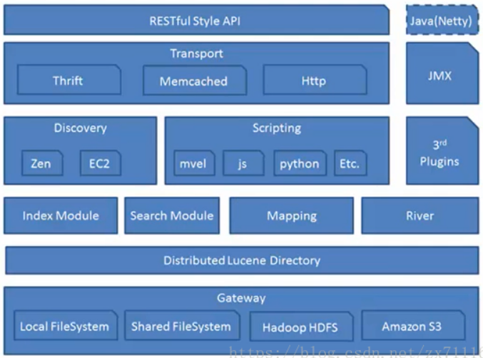

##### es基本概念
+ Index
类似于mysql数据库中的database
Type
类似于mysql数据库中的table,es中可以在Index中建立type（table）,通过mapping进行映射。
+ Document
由于es存储的数据书文档型的，一条数据对应一篇文档及相当于mysql数据库中的一行数据row,一个文档中可以有多个字段也就是mysql数据库
一行可以有多列。     Field      es中一个文档中对应的多个列与mysql数据中每一列对应
+ Mapping
可以理解为mysql或者solr中对应的schema。只不过有些时候es中的mapping增加了动态识别功能，感觉很强大的样子，其实实际生产环境上
不建议使用，最好还是开始制定好了对应的schema为主
+ indexed
就是名义上的建立索引。mysql中一般会经常使用的列增加了相应的索引用于提高查询速度，而在es中默认都会加上索引的，除非你特殊制定
不建立索引只是进行存储用于展示，这个需要看你具体的需求好业务进行设定了
+ Query DSL
类似于mysql的sql语句，只不过在es中是使用的json格式的查询语句，专业术语：QueryDSL
+ GET/PUT/POST/DELETE
分别类似于mysql中的select/update/delete...

##### es的架构

