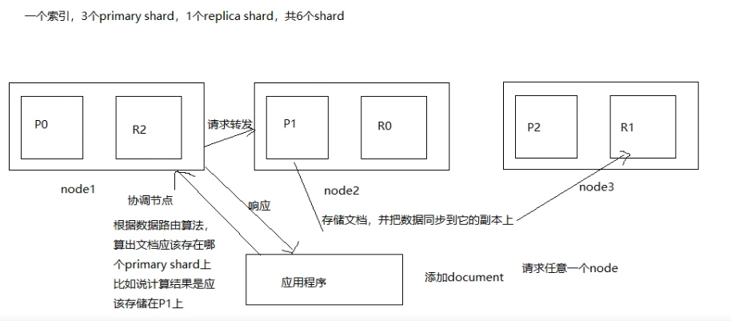

#### 文档的核心元数据
##### 1._index
    说明了一个文档存储在哪个索引中
    同一个索引下存放的是相似的文档（文档的field多数是相同的）
    索引名必须是小写的，不能以下划线开头，不能包括逗号
##### 2._type
    表示文档属于索引中的哪个类型
    一个索引下只能有一个type
    类型名可以是大写也可以是小写的，不能以下划线开头，不能包括逗号
##### 3._id
    文档的唯一标识，和索引，类型组合在一起唯一标识了一个文档
    可以手动指定值，也可以由es来生成这个值
    
#### 文档id生成方式
    1 手动指定
    PUT /lib3/user/56 {}
    通常是把其它系统的已有数据导入到es时
    查看： GET /lib3/user/_mapping
    2 由es生成id值
    POST /index/type
    es生成的id长度为20个字符，使用的是base64编码，URL安全，使用的是GUID算法，分布式下并发生成id值时不会冲突

#### _source元数据分析
    其实就是我们在添加文档时request body中的内容
    指定返回的结果中含有哪些字段：
    GET /index/type/1?_source=name
#### 改变文档内容原理解析
    替换方式：
    PUT /lib/user/4 { "first_name":"jane",
    "last_name":"Lucy",
    "age":24,
    "about":"I like to collect rock albums",
    "interests":["music"]
    }
    修改方式（partial update）：
    POST /lib/user/2/_update {"doc":{"age":26}}
    删除文档：标记为deleted,随着数据量的增加，es会选择合适的时间删除掉
    
    ##更新文档对并发问题的处理
    POST /lib/user/4/_update?retry_on_conflict=3&version=5
    retry_on_conflict:
    重新获取文档数据和版本信息进行更新，不断的操作，最多操作的次数就是retry_on_conflict的值
    
#### 基于groovy脚本进行部分更新
    #修改数字
    GET /lib/user/4/_update {
      "script":"ctx._source.age+=1"
    }
    #修改字符串
    GET /lib/user/4/_update {
      "script":"ctx._source.last_name+='hh'"
    }
    #添加数组
    GET /lib/user/4/_update {
      "script":{
        "source":"ctx._source.interests.add[params.tag]",
        "params":{
           "tag":"football"
        }
      }
    }
    #删除数组
    GET /lib/user/4/_update {
      "script":{
        "source":"ctx._source.interests.remove(ctx._source.interests.indexOF(params.tag))",
        "params":{
           "tag":"football"
        }
      }
    }
    # 删除文档
    GET /lib/user/4/_update {
       "script":{
         "source":"ctx.op=ctx._source.age==params.count?'delete':'none'",
         "params": {
            "count":22
         }
       }
    }
    # upsert操作: 如果文档不存在会进行初始化，如果存在执行script操作
    GET /lib/user/4/_update {
      "script":"ctx._source.age+=1"，
      "upsert":{
         "first_name":"jane",
         "last_name":"Lucy",
         "age":24,
         "about":"I like to collect rock albums",
         "interests":["music"] 
      }
    }
    
#### 文档数据路由原理解析
    1.文档路由到分片上：
    一个索引由多个分片构成，当添加（删除，修改）一个文档时，es就需要决定这个文档存储在哪个分片上，这个过程就称为
    数据路由（routing）
    2.路由算法：
    shard=hash(routing) % number_of_pirmary_shards
    示例：一个索引，3个primary shard
    (1)每次增删改查时，都有一个routing值，默认是文档的_id的值
    (2)对这个routing值使用哈希函数进行计算
    (3)计算出的值再和主分片个数取余数
    余数肯定在0--- （number_of_pirmary_shards-1）之间，文档就在对应的shard上
    routing值默认是文档的_id的值，也可以手动指定一个值，手动指定对于负载均衡以及提供批量读取的性能都有帮助
    3.primary shard个数一旦确定就不能修改了
#### 文档增删改原理

#### 写一致性原理和quorum机制
    1.任何一个增删改操作都可以跟上一个参数 consistency
    可以给该参数指定的值：
    one:(primary shard)只要有一个Primary shard是活跃的就可以执行
    all:(all shard)所有的primary shard 和replica shard都是活跃的才能执行
    quorum:(default)默认值，大部分shard是活跃的才能执行(例如共有6个shard,至少有3个shard是活跃的才能执行写操作)
    2.quorum机制：多数shard都是可用的，
    int((primary+number_of_replica)/2)+1
    例如：3个primary shard, 1个replica
    int((3+1)/2)+1=3
    至少3个shard是活跃的
    注意：可能出现shard不能分配齐全的情况
    比如：1个primary shard，1个replica int((1+1)/2)+1=2 但是如果只有一个节点，因为primary shard和replica shard不能在同一个节点上，
    所以仍然不能执行写操作
    再举例：1个primary，3个replica，2个节点
    int((1+3)/2)+1=3
    最后：当活跃的shard的个数没有达到要求时，es默认会等待一分钟，如果在等待的期间活跃的shard的个数没有增加，则显示timeout
    PUT /index/type/id?timeout=60s
    
#### 文档查询内部原理
    第一步：查询请求发给任意一个节点，该节点就成了 coordinating node，该节点使用路由算法算出文档所在的primary shard
    
    第二步：协调节点把请求转发给primary shard也可以转发给replica shard使用轮询调度算法（Round-Robin Scheduling,把请求平均分配至primary shard
    和replica shard）
    
    第三步：处理请求的节点把结果返回给协调节点，协调节点再返回给应用程序
    
    特殊情况：请求的文档还在建立索引的过程中，primary shard 上存在，但replica shard上不存在，但是请求被转发到了replica shard上，这时就会提示
    找不到文档
    
#### bulk语法格式解析，批量操作的json格式解析
    bulk的格式：
    {action:{metadata}}\n
    {requstbody}\n
#### 多index，多type查询
    GET /_all/_search
    GET _search
    GET /lib,lib4/user,items/_search
    GET /_all/user,items/_search
    
#### 分页查询中的deep paging 问题
    GET /lib3/user/_search {"from":0, "size":2,"query":{"terms":{"interests":["hejiu","changge"]}}}
    GET /_search?from=0&size=3
    deep paging查询的很深，比如一个索引有三个primary shard,分别存储了6000条数据，我们要得到第100页的数据（每页10条），类似这种情况就
    叫deep paging
    
    如何得到第100页的10条数据？
    
    在每个shard中搜索990到999这10条数据，然后用这30条数据排序，排序之后取10条数据就是要搜索的数据，这种做法是错的，因为3个shard中的数据
    的_score分数不一样，可能这某一个shard中第一条数据的_score分数比另一个shard中第1000条都要高，所以在每个shard中搜索990到999这10条
    数据然后排序的做法是不正确的。
    
    正确的做法是每个shard把0到999条数据全部搜索出来（按排序顺序），然后全部返回给 coordinate node，由coordinate node按_score分数排序后，
    取出第100页的10条数据，然后返回给客户端。
    
    deep paging性能问题
    1.耗费网络带宽，因为搜索过深的话，各shard要把数据传送给coordinate node，这个过程是有大量数据传递的，消耗网络
    2.消耗内存，各shard要把数据传送给coordinate node，这个传递回来的数据，是被coordinate node保存在内存中的，这样会大量消耗内存
    3.消耗cpu coordinate node要把传回来的数据进行排序，这个排序过程很消耗cpu
    
    鉴于deep paging的性能问题，所以应尽量减少使用
    
